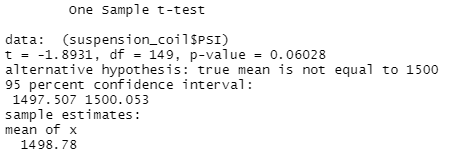

#### Challenge 15: Module 15

# Overview of Project

## Purpose of MechaCar Statistical Analysis
The Challenge consisted in the creation of an analysis for insights from a review of production data. The insights are required to help the manufacturing team. The problem came from a new prototype named MechaCar, the model has some troubles that make other processes inefficient. The analysis is required to obtain a specific answer to the problem.

# Results
## Linear Regression to Predict MPG
The first part of the Challenge consisted in the analysis of the summary of a linear regression for the MPG prediction. The results of the summary can be seen in Image 1. Analyzing each part of the summary, it is known that the coefficients that provided a non-random amount of variance to the mpg values in the dataset are vehicle_length and ground_clearance. Both coefficients have a Pr value less than the significance level of 0.05, having three asterisks at the right of the number as a code. The other coefficients vehicle_weight, spoiler_angle and AWD don’t have a statistically significant relationship with the MPG variable in the model.
Image 1. shows the summary of the linear model, where the p-value is 5.35e-11. The p-value demonstrates that the null hypothesis is rejected because it is smaller than 0.05. The slope of the linear model is considered to be not zero because of the p-value. On the other hand, the R-squared value is 0.7149 being 71% the probability of using the model to predict the mpg correctly. It can be concluded that the linear model predicting mpg of MechaCar prototypes is effective.

###### Image 1. Summary of Linear Regression.

## Summary Statistics on Suspension Coils

The next part of the analysis consisted in the creation of summary statistics for suspension coils. One important design specification for the MechCar suspension coils that needed to be evaluated is the variance, it must not exceed 100 pounds per square inch. The total summary and the lot summary helped to visualize if the data meet the specification in total and in each lot. The results for the total summary of the suspension coils of all the lots is in Image 2. In this case, the variance has a value of 62.29356 being less than the 100 PSI. The result of the total summary is within the range. For the case of the summary of each lot individually, the results of Image 3. demonstrate that lot1 and lot2 are also within the range having 0.9795918 and 7.4693878 as variance, respectively. Lot3 has a variance of 170.2861224, the value is higher than 100 PSI. The design specifications for lot3 doesn’t correspond to the one expected. 

###### Image 2. Total Summary.

###### Image 3. Lot Summary.

## T-Tests on Suspension Coils

Another required test for the analysis is the t-test for the suspension coils. Image 4. contains the results of the t-test for all the lots. The p-value is 0.06028, which is higher than the significance level of 0.05. The mean is 1498.78, which is quite similar to the population mean of 1500. Both results show that the null hypothesis can’t be rejected because there is not enough evidence.

###### Image 4. T-test Results.

The next 3 Images represent the results of the t-test of each lot individually. Image 5. shows the data from lot 1, where the p-value=1 and the mean is equal to 1500, as it should be. Both results tell that the null hypothesis can’t be rejected, it is not significantly different. In Image 6., the results of the t-test of lot 2 are similar to the ones of lot 1, so the conclusions are the same. While in Image 7., the results of lot 3 show a difference having 0.04168 as p-value. The value is under the common significance level of 0.05. The mean is similar to 1500. In this case, the null hypothesis should be rejected.

###### Image 5. T-test for Lot 1.

###### Image 6. T-test for Lot 2.

###### Image 7. T-test for Lot 3.

## Study Design: MechaCar vs Competition

